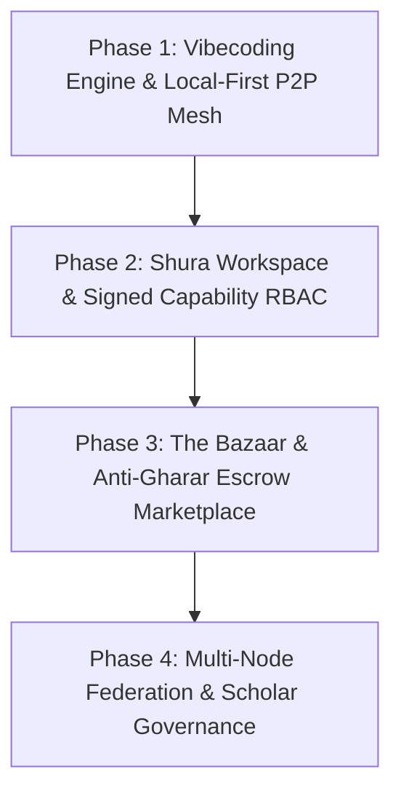

# Taawun Platform Blueprint v0.2 — Frontier Model Execution Master Plan

> *"And cooperate in righteousness and piety"* — Surah Al-Ma'idah 5:2  
> **Repository Target**: `https://github.com/99-dollars-an-app/taawun.git`  
> **Branch**: `main`

---

## Executive Overview & Architectural Invariants

Taawun is a vibecoding platform for the Ummah: Lovable's build experience, rebuilt on local-first peer-to-peer foundations, with Islamic compliance enforced structurally rather than cosmetically.

### Non-Negotiable Core Invariants (Amanah & Zero Custody)
1. **Zero Data Custody (Amanah)**: Taawun central servers NEVER custody readable community data. Applications are static microfrontends. Data lives on user devices, replicated via RxDB over WebRTC. Centrally hosted infrastructure is strictly limited to **Taawun SSO** (identity) and **Relay Infrastructure** (WebRTC signaling, TURN/STUN, encrypted sync super-peers).
2. **The State Split**:
   - **Convergent State** (content, schedules, page copy, themes) $\rightarrow$ Lives in CRDT-backed RxDB collections synced peer-to-peer over WebRTC. Offline edits are first-class; eventual consistency applies.
   - **Transactional State** (balances, payments, escrows, splits, pledges) $\rightarrow$ MUST NEVER live in a CRDT. Delegated to **AZOA quest graphs** (fail-closed, exactly-once settlement).
3. **5 System Layers**:
   - *Layer 1: Vibecoding Engine* (LLM + MCP + sandbox + Compliance RAG).
   - *Layer 2: Shared Primitives* (Taawun SSO, WebRTC signaling, STUN/TURN, sync super-peers).
   - *Layer 3: App Runtime* (Microfrontend shell, RxDB WebRTC replication, IndexedDB, Taawun SDK).
   - *Layer 4: Financial Orchestration (AZOA)* (Marketplace quests + STAR financial primitives).
   - *Layer 5: Compliance Infrastructure* (Scholar-authored RAG guardrail corpus).
4. **RBAC as Signed Capabilities**: Identity tokens issued by Taawun SSO carry Ed25519-signed capability scopes gating write access to CRDT collections and AZOA quest execution (`Architect`, `Maintainer`, `Viewer`).

---

## Master Implementation Phases for Frontier Models



---

### Phase 1: Real-time Vibecoding Engine & Local-First P2P Mesh

**Goal**: Connect LLM vibecoding agents with sandboxed microfrontend bundle compilation, WebRTC signaling relays, and RxDB browser replication.

#### Tasks for Frontier Model
- [ ] **Compliance RAG Context Injector (`pkg/ethics/rag.go`)**:
  - Implement RAG retrieval for scholar-authored fiqh rulings.
  - Pre-append relevant rulings to LLM prompts during code generation (e.g. converting conventional loan requests to Qard Hasan / Murabaha structures).
- [ ] **Static Microfrontend Bundle Synthesizer (`pkg/mcp/bundler.go`)**:
  - Extend MCP server tools (`build_microfrontend`, `preview_bundle`) to package generated React/Svelte HTML5/JS into ES modules using import maps.
  - Embed Taawun SDK into generated artifacts (`window.TaawunSDK = { sync: RxDB, financial: AzoaClient, auth: SSO }`).
- [ ] **WebRTC Super-Peer Encrypted Relay (`pkg/primitives/relay.go`)**:
  - Implement WebSocket/WebRTC signal exchanger with End-to-End Encryption (E2EE) fallback storage for offline super-peers.
  - Guarantee zero-knowledge transit where relay nodes cannot read payload bytes.

#### Verification Criteria
```bash
go test ./src/pkg/mcp/... ./src/pkg/primitives/... ./src/pkg/ethics/...
```

---

### Phase 2: The Shura Workspace & Capability-Based RBAC

**Goal**: Formalize multi-member community workspaces with cryptographic, signed capability tokens gating access to CRDT collections and AZOA financial quests.

#### Tasks for Frontier Model
- [ ] **Ed25519 Token Signing & Verification (`pkg/shura/rbac.go`)**:
  - Implement Ed25519 key pair generation for Taawun SSO.
  - Sign JWT capability tokens with scope restrictions:
    - `Architect`: `crdt:*`, `azoa:*`, `bazaar:publish`
    - `Maintainer`: `crdt:convergent:*`
    - `Viewer`: `crdt:read:*`
- [ ] **RxDB Permission Middleware**:
  - Expose verification middleware in the browser Taawun SDK to enforce capability token validation before applying CRDT remote delta merges.
- [ ] **Multi-Party Financial Approval Quest Steps**:
  - Extend `pkg/financial/azoa.go` to support multi-sig approvals for transactions exceeding configurable thresholds (e.g. Mosque Treasurer + President sign-off).

#### Verification Criteria
```bash
go test ./src/pkg/shura/...
```

---

### Phase 3: The Bazaar & Anti-Gharar Deployment Lifecycle

**Goal**: Build the template marketplace with mandatory live staging previews (anti-gharar), automated fiqh-linting, and AZOA escrow settlement quests.

#### Tasks for Frontier Model
- [ ] **Live Staging Preview Environment (`pkg/ethics/anti_gharar.go`)**:
  - Enforce pre-checkout live preview rendering in sandboxed Docker containers (`pkg/iac/docker_provider.go`).
  - Provide buyers with explicit SLA, relay tier specs, and capacity metrics before payment confirmation.
- [ ] **AZOA Escrow Quest Settlement (`pkg/financial/azoa.go`)**:
  - Implement 2-phase settlement: `MARKETPLACE_ESCROW_LOCK` $\rightarrow$ Buyer Staging Confirmation $\rightarrow$ `SETTLED` (or `FAILED_CLOSED` refund on unconfirmed/ambiguous state).
  - Execute automated platform fee and creator commission splits in a single immutable quest graph step.
- [ ] **Fiqh-Linter CI Pipeline at Template Publish**:
  - Run AST static code analysis against the scholar guardrail corpus prior to showcase in The Bazaar.
  - Flag prohibited financial models, gambling patterns, or un-vetted external API dependencies.

#### Verification Criteria
```bash
go test ./src/pkg/financial/... ./src/pkg/ethics/...
```

---

### Phase 4: Federation & Autonomous Community Infrastructure

**Goal**: Enable communities to self-host relay nodes, federate AZOA quest nodes, and establish decentralized governance.

#### Tasks for Frontier Model
- [ ] **Community Self-Hosted Relay Binary**:
  - Provide a zero-dependency Go binary (`taawun-relay`) that mosques and charities can deploy on cheap VPS or home hardware.
- [ ] **AZOA Multi-Node Federation Protocol**:
  - Enable quest graph cross-settlement between independent AZOA nodes (e.g. Inter-mosque relief fund quests).
- [ ] **Madhhab-Tagged Compliance Corpus**:
  - Upgrade Compliance RAG to support school-of-thought metadata tags (`Hanafi`, `Shafi'i`, `Maliki`, `Hanbali`) allowing community workspaces to select their preferred jurisprudence baseline.

---

## Instructions for Frontier AI Agents

When taking on this implementation plan in future sessions:

1. **Working Directory & Workspace**:
   - Codebase location: `c:\Users\atooz\Programming\tawun` (or repo root).
   - Go module directory: `src/` (configured in root `go.work`).
2. **Key File Locations**:
   - Conductor Tracks: `conductor/tracks/`
   - Product Specifications: `conductor/product.md`
   - Tech Stack: `conductor/tech-stack.md`
   - Go Packages: `src/pkg/` (`conductor`, `ethics`, `financial`, `shura`, `primitives`, `mcp`, `iac`)
3. **Testing Command**:
   ```bash
   go test ./src/pkg/...
   ```
4. **Build Command**:
   ```bash
   go build -o deliverable/Taawun.exe ./src/cmd/main.go
   ```
5. **Git Protocol**:
   - Remote target: `https://github.com/99-dollars-an-app/taawun.git`
   - Primary branch: `main`
   - Always verify clean `go test ./src/pkg/...` before committing and pushing.
